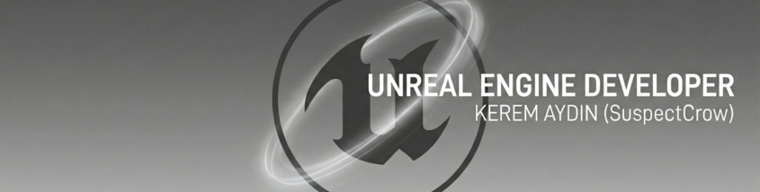

  

    

  
  
  

 

# Hi there, I'm Kerem (SuspectCrow) 👋

### 🚀 Unreal Engine Developer & Backend Specialist

I started my software journey 6 years ago. Today, I am a professional **Unreal Engine (C++)** focused game developer, meticulous about performance, optimization, and clean code architecture.

As the Co-Founder of **Eclion Software**, I managed the publication process of our games "Envguard" and "Envguard Mobile" on Steam and the Samsung Store. I take active roles in developing complex systems like Co-op Multiplayer mechanics, in-game tools, and gameplay programming.

Beyond game development, I leverage my strong **ASP.Net** backend background to build robust mobile applications using **React Native** (currently developing 'Crowpedia') and design atomic SQL database architectures for scalable data persistence.

I am currently open to professional opportunities where I can contribute my technical expertise to large-scale projects and grow alongside experienced teams.

---

### 🛠️ Technical Stack & Tools

I believe in using the right tool for the job. Here is a curated list of my core technologies:

#### 🎮 Game Development Core

  
  
  

#### 🌐 Backend & Languages

  
  
  
  
  
  

#### 💾 Database Management

  
  
  

#### 📱 Web & Mobile Frontend

  
  
  
  
  
  
  

#### 🎨 Design & Build Tools

  
  
  
  

---

   
  
    
  

